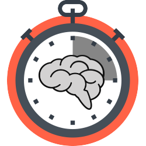

# 
NEURODORO

    

A brain-responsive Pomodoro timer for maximum productivity.

  

## Overview

The goal behind Neurodoro is to create a fun, helpful application for EEG in everyday life. It is also an opportunity to practice applying machine learning library to EEG data.

If you've ever used the Pomodoro technique, you know that it can be helpful to avoid procrastination by breaking work up into manageable chunks. However, you might also appreciate how annoying it is when the tecnique forces you to stop working while you're still on task and 'in the zone'. What if we could make an app that would alter the length of a Pomodoro session, giving you more time if you're concentrated and less time if you're distracted? That's Neurodoro.

Neurodoro is still entirely in development. So far, we have built a simple Pomodoro Timer with React Native and allowed to it record EEG data from a Muse headband while a user takes a cognitive test. The [cognitive test](https://github.com/StanfordCosyne/screener) is attentionally demanding and uses ML itself to scale difficulty based on a user's performance. By recording large datasets of user brain data labeled with the difficulty and performance scores from the cognitive test, we hope to be able to develop an algorithm that can determine whether the attentional and cognitive performance of a user is high or low based on a 2s epoch of their brainwaves.

Because we want this classifier to run locally on a smartphone with a continuous stream of data from the Muse, we would like the end-product of our algorithm development to be a TensorFlow graph that can be [exported to Android](https://www.tensorflow.org/mobile/).

## Contact

If you want to get involved with the Neurodoro project, get in touch with us on the [NeuroTechX Slack](https://neurotechx.herokuapp.com/). You'll find our thoughts, discussions, and plans to work together in the #neurodoro channel.

## Setup

1. Install and setup [React Native](https://facebook.github.io/react-native/docs/getting-started.html). Note: Neurodoro uses lots of native code, so create-react-native-app and Expo are not an option. Follow the instructions for "Building Apps with Native Code." You may also need to install the [JDK](https://www3.ntu.edu.sg/home/ehchua/programming/howto/JDK_Howto.html), [Node](https://nodejs.org/en/download/package-manager/), [Watchman](https://medium.com/@vonchristian/how-to-setup-watchman-on-ubuntu-16-04-53196cc0227c), and the [Gradle Daemon](https://docs.gradle.org/2.9/userguide/gradle_daemon.html) as well
2. Install [yarn](https://github.com/yarnpkg/yarn)
3. Clone this repo `git clone https://github.com/NeuroTechX/neurodoro.git`
4. run `yarn install` in the neurodoro folder
5. Connect an Android device with USB debug mode enabled. Because the LibMuse library depends on an ARM architecture, emulators are not an option
6. Run `react-native start` to start React packager
7. In new terminal, run `adb reverse tcp:8081 tcp:8081` to ensure debug server is connected to your device and then `react-native run-android` to install neurodoro
